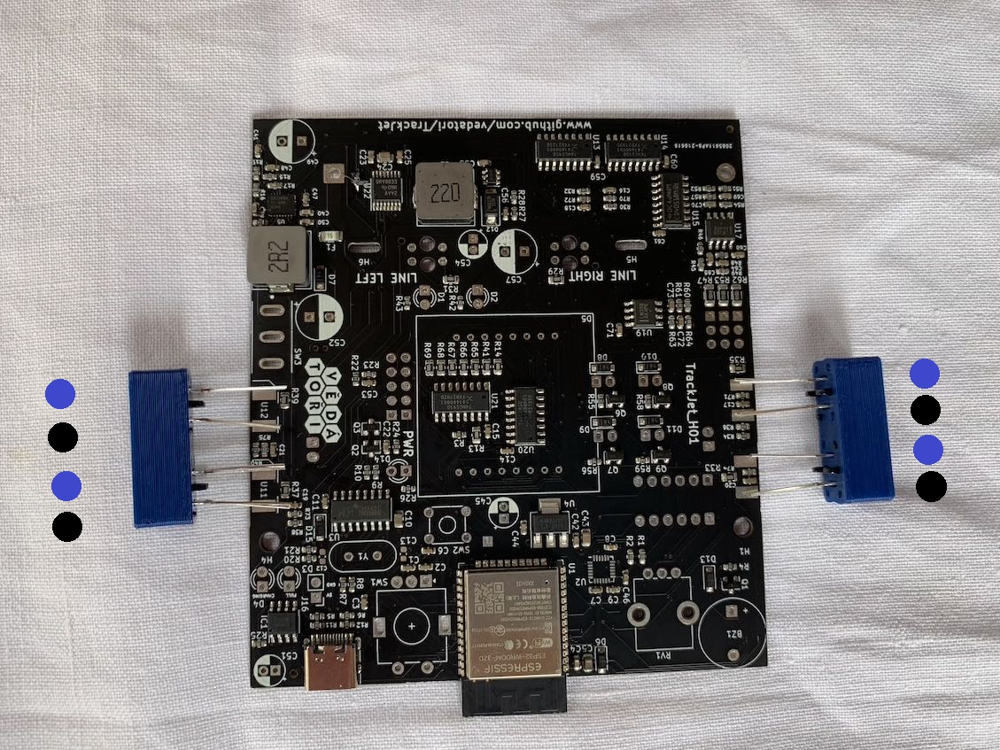
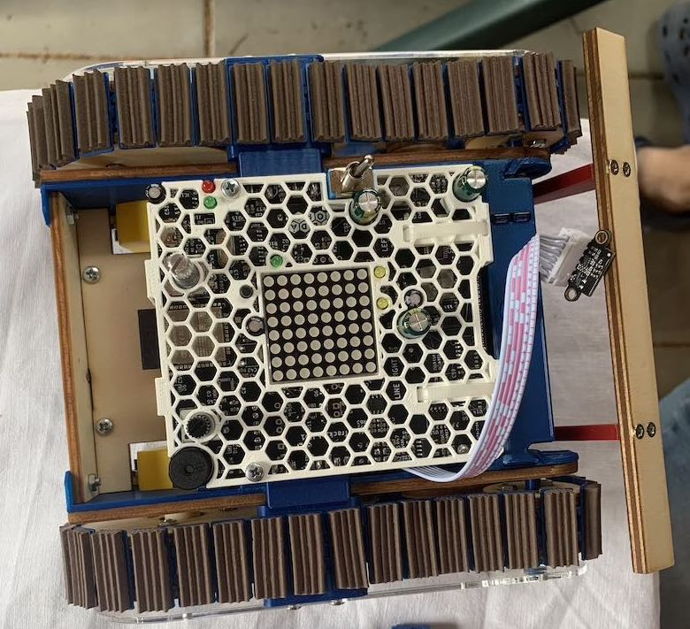

V tomto dokumentu je uveden návod na osazení desky plošných spojů. Část je osazena již z výroby SMD součástkami. Zbytek osazení je předmětem tohoto návodu.
Pro tento návod si uvedeme následující pojmy: DPS = PCB = deska - Deska Plošných Spojů.
Deska pro TrackRay je již z výroby osazena SMD (bezvývodovými) součástkami. THT (vývodové) se pájí následujícím způsobem:
* Součástku vkládáme ze strany, kde je naznačena silkscreenem (kde je bílou barvou natištěn její obrys).
* Součástku přitlačíme až k desce nebo co nejblíž.
* Součástku pájíme ze strany, na kterou trčí vývody.
* Vývody po zapájení zastřihneme.

# Obsah
* [Pájení senzorů pohybu](#LED1)
* [Pájení LED](#LED2)
* [Pájení malých součástek](#male)
* [Pájení větších součástek](#vetsi)
* [Pájení konektorů a senzorů čáry](#konektory)
* [Zakrytování PCB, propojení periferií](#finalizace1)
* [LIDAR](#finalizace2)
* [LIDAR2](#finalizace3)

## <a name = LED1>Pájení senzorů pohybu</a>
**Potřebujeme:**
* kleště
* 4x modul s LED a fotodiodou
* 2x plastový držák pro modul z 3D tisku
* 2x plastový vymezovač z 3D tisku
* 2x šroub M3x8

**Postup:**
1. Vložte postupně moduly do držáku z 3D tisku. *Je třeba dodržet orientaci diod s obrázkem pro jednotlivé strany. Modrá čára na schématu označuje pozici "nosu" na součástce.* Barvu diod je možné rozpoznat pod světlem např. z LED telefonu.

1. Opakujte postup pro druhou stranu 2 podle schématu. Zarovnejte nožičky podle obrázku, aby obejmuly shora a zespodu PCB a směřovali doprostřed pájecí plochy. *Nos na součástce je nahoře.*

1. Použijte zarovnávací nástroj z 3D tisku, umístěte do něj moduly podle obrázku. Na vyznačené červené čáře zakraťte vývody kleštěmi.

1. Zarovnávací nástroj z 3D tisku umístěte pod PCB a přišroubujte šroubkem.

1. Zarovnejte nožičky podle obrázku, aby obejmuly shora a zespodu PCB a směřovaly doprostřed pájecí plochy. *Modul z 3D tisku musí přiléhat k PCB bez mezery.*

1. *Zapájejte z horní strany PCB.*
1. Vyšroubujte díl pro zarovnání z 3D tisku. 

1. Otočte na druhou stranu, vyrovnejte nožičky na střed pájecí plochy. Zapájejte.

1. Otestujte, zda PCB padne do šasi. *Při usazování netlačte. Pokud deska nezapadne hladce, zavolejte vedoucího.*

## <a name = LED2>Pájení LED</a>
**Potřebujeme:**
* kleště
* 2x zelená LED
* 1x červená LED
* 2x LED oblíbené barvy vlastního výběru
* 5x distanční sloupek pro LED

**Postup:**
**POZOR: LED mají definovanou polaritu!** U každé LED zkontrolujte, že kratší nožku vsouváte do čtveraté díry! 
1. Na každou LED navlékněte distanční sloupek.

1. Provlékněte červenou LED místem označeným D4 CHARGE. Zahněte nožičky natěsno u PCB. Cín se nanáší ze strany s logem Coufal Elektronika. Zapájejte.

1. Provlékněte červenou LED místem označeným D3 FULL. Opakujte stejný postup pájení jako v předchozím kroku.

1. Zastřihněte nožičky u PCB. *Stříhanou nožičku držte rokou, aby neodletěla sousedovi do oka.*

1. Obdobným postupem zapájejte zelenou LED místem ozančeným D13 a vybrané LED místy označenými D1 a D2.

## <a name = male>Pájení malých součástek</a>
**Potřebujeme:**
* kleště
* bzučák
* 3x elektrolytický kondenzátor 100 µF (menší pouzdro)
* 3x elektrolytický kondenzátor 1000 µF (větší pouzdro)

**Postup:** 
1. Zapájejte buzzer do levého horního rohu. Pozor na polaritu, delší vývod (u symbolu plus na etiketě buzzeru) musí být umístěn do otvoru označeným symbolem +. 

1. Na místa označená C51, C54 a C45 zapájejte elektolytické kondenzátory 100 µF. Pozor na polaritu, delší vývod musí směřovat do otvoru, u kterého je smybol + a jeho okolí není zabarvené bílou barvou. 

1. Na místa označená C49, C52 a C57 zapájejte elektolytické kondenzátory 1000 µF. Pozor na polaritu, delší vývod musí směřovat do otvoru, u kterého je smybol + a jeho okolí není zabarvené bílou barvou. 

## <a name = vetsi>Pájení větších součástek</a>
**Potřebujeme:**
* kleště
* přepnínač
* rotační enkodér
* ponteciometr
* matice LED

**Postup:** 
1. Zapájejte přepínač na místo označené SW3.

1. Zapájejte enkodér na místo označené SW1. *Nejprve připájejte kontakty po bocích, poté 3 vývody ze spodní strany. Zkontrolujte, že je enkodér přitlačený k desce a osa čouhá kolmo na desku.*

1. Zapájejte potenciometr na místo označené RV1. *Nejprve připájejte kontakty po bocích, poté 3 vývody ze spodní strany. Zkontrolujte, že je potenciometr přitlačený k desce a osa čouhá kolmo na desku.*

1. Vložte matici LEDek do PCB. Kód na horní straně musí být blíž k čipu s nápisem Espressif, aby byla zachována polarita, viz obrázek.

1. Zahněte pomocí kleští krajní nožičky, aby matice nevypadávala při pájení z desky.

1. Zapájejte matici LEDek.

## <a name = konektory>Pájení konektorů a senzorů čáry</a>
**Potřebujeme:**
* kleště
* 2x konektor se 2 piny
* 1x konektor se 6 piny
* 3x kolíková lišta se třemi konektory
* 2x modul s dvěma diodami
* 2x podpěry modulu s LED diodami z 3D tisku
* držák baterie

**Postup:** 
1. Zapájejte kolíkové lišty do míst označených SERVO 1, SERVO 2, SERVO 3. Vytvořte libovolnou barevnou kombinaci. *Kolíková lišta musí být vždy rovnoběžně s nápisy SERVO.*
 
1. Zapájejte lišty konektorů do míst LIDAR1, J6 a J7. Polarita je vždy zřejmá z nákresu na PCB.

1. Provlečete modul s dvěma LED diodami podpěrou. *Veškerá zkosení modulu jsou i na podpěře a musí lícovat. Z jedné strany podpěry je výřez pro kolík vystupující ze součástky.*

1. Připájejte moduly s podpěrou na místa označená U7 a U8. Polarita je zřejmá z nákresu na PCB.

1. Zapájejte držák baterie. Důsledně zkontrolujte polaritu.

1. Překontrolujte desku zepředu.

1. Překontrolujte desku zezadu.

**Nechte desku překontrolovat vedoucím. Nechte si od něj vložit baterku.**

## <a name = finalizace1>Zakrytování PCB, propojení periferií</a>
**Potřebujeme:**
* kryt desky z 3D tisku ve tvaru plástve
* 2x stahovací páska
* oboustranná lepicí páska
* kleště

**Postup:**
1. Přichyťte baterku a kryt k PCB pomocí velkých upínacích pásků, jejich konce zastřihněte kleštěmi. Pásky protahujte díryami H5 a H6 v desce. Hlavy upínacích pásků dejte do stejné pozice, jako vidíte na obrázku.

1. Konce pásků zastřihněte kleštěmi.

1. Konce pásků zastřihněte kleštěmi.

1. Vystřihněte kousek oboustranné lepicí pásky. Vlepte jej do prostoru mezi otvory pro senzory čáry.

1. Zachyťe kabely od servomotorů na pásku.

1. Zastrčte konektory motoru do desky, jak je naznačeno na obrázku.

1. Připojte vývody od servo motoru na kolíkovou lištu. Výstup SERVO 1 je určen pro radlici. Výstup SERVO 2 je určen pro LIDAR.

## <a name = finalizace2>LIDAR</a>
**Potřebujeme:**
* LIDAR

**Postup:**
1. Připojte vývod LIDARu na konektor LIDAR. Kabel proveďte okolo PCB stejně jako na obrázku.

1. Přišroubujte desku pomocí sřoubů k šasi.

## <a name = finalizace3>LIDAR 2</a>
**Potřebujeme:**
* vrut z balení k servomotoru
* 2x vrut 2,2x10

**Postup:**
1. *Vytočte servo motor na maximum doleva.* Nasaďte na servomotor držák v úhlu 90° vůči šasi.

1. Přišroubujte držák pomocí vrutu z balení k servomotoru.

1. Vložte LIDAR a zašroubujte kryt.

1. Výsledná podoba.
