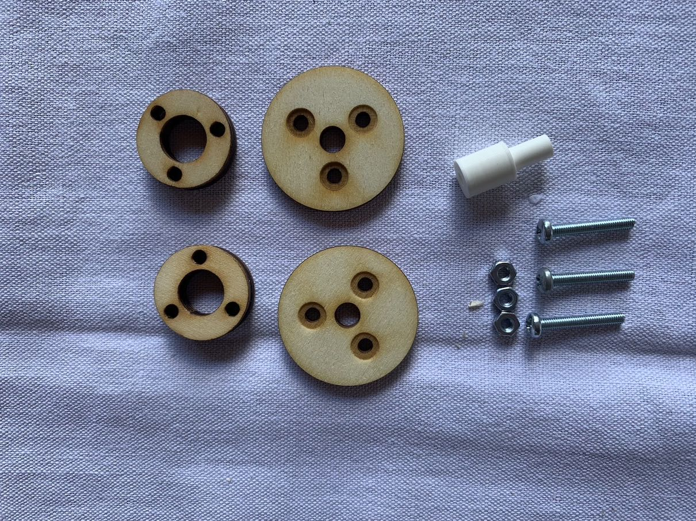
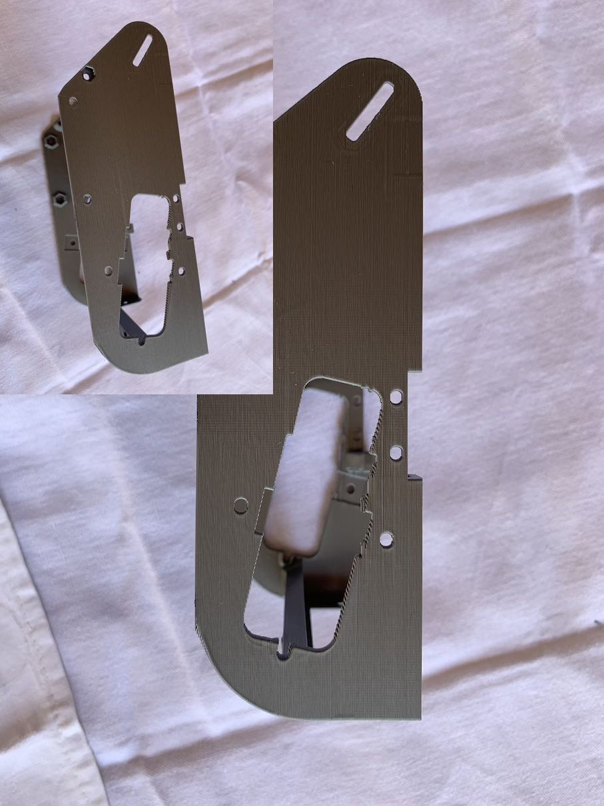
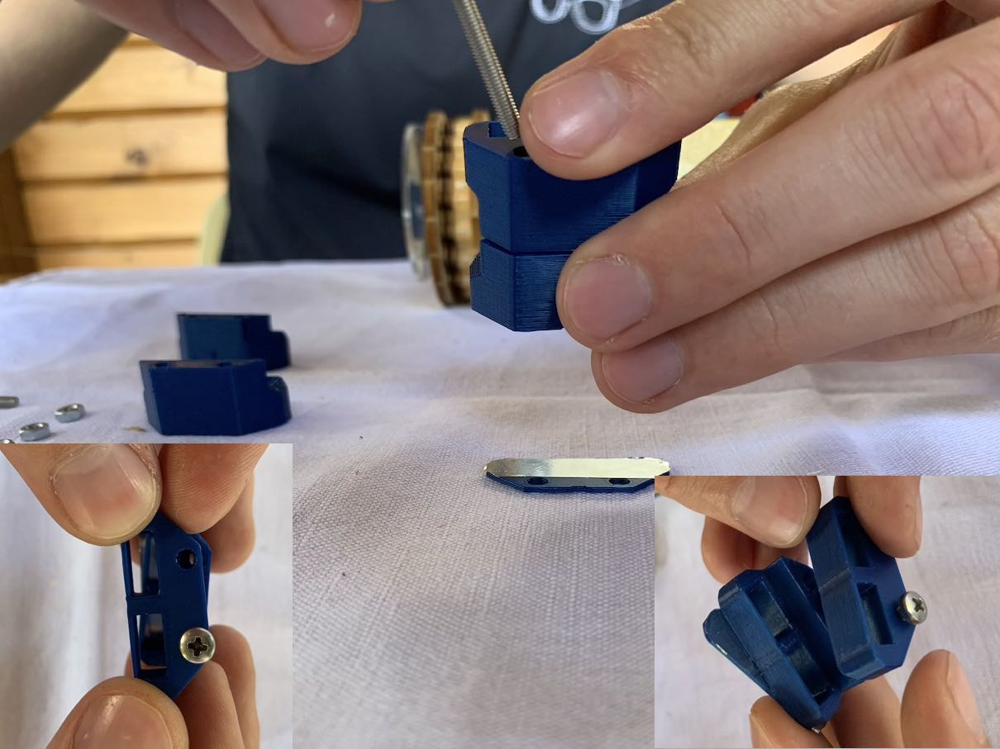

V tomto dokumentu je uveden návod na sestavení mechanických dílů vozítka TrackJet. Část mechanických dílů je vyrobena technologií 3D tisku, část je vyřezána z překližky a plexiskla pomocí laseru. Ostatní součástky jsou běžně dostupný spojovací materiál. Dále je vsazena deska plošných spojů (DPS), kterou se zabývá samostatný návod.

___
# Obsah
* [Příprava překližkových dílů](#preklizka)
* [Sestavení velkých kol](#kolo)
* [Sestavení malých kol](#kolecka)
* [Příprava bočnic #1](#bocnice1)
* [Příprava držáků motorů](#drzaky)
* [Sestavení bočnic](#bocnice2)
* [Nasazení kol](#kola)
* [Kompletace šasi #1](#sasi1)
* [Příprava bočnic #2](#bocnice3)
* [Kompletace šasi #2](#sasi2)
* [Držák servo motoru](#serva)
* [Sestavení radlice](#radlice)
* [Polepení pásů](#pasy1)
* [Slepení pásů](#pasy2)
* [Nasazení pásů](#pasy3)
___

## <a name = preklizka>Příprava překližkových dílů</a>
**Potřebné díly:**
* všechny díly z překližky

**Nástroje:**
* smirek

**Postup:**
1. Obruste smirkem všechny nedořezky.
    

## <a name = kolo>Sestavení velkých kol</a>
**Potřebné díly:**

* 2x kolo neozubené velké z překližky
* 1x kolo ozubené velké z překližky
* 1x kolo ozubené velké 3D tisk
* 3x matka M3
* 3x šroub M3x20

**Nástroje:**
* křížový šroubovák
* maticový klíč

**Postup:**
1. Pořadí navlékání. 
    
1. Provléct šroub skrz díru pod malou dírkou ve velkém kole z překližky. Hlava šroubu zapadne do zahloubení. Navléct ozubené kolo z překližky. *Malé dírky musí padnout na sebe.*
    
1. Navléct 3D tištěný díl tak, aby výstupek pro zastrčení osy směřoval směrem od dřevěných dílů. *Malé dírky musí opět padnout na sebe.*
    
1. Navléct neozubené velké kolo z překližky. Zašroubovat matku. Neutahovat.
    
1. Doplnit zbylé šrouby a matky.
    
1. Díly vystředit vůči sobě. Všechny matky utáhnout (přitlačit prstem do zahloubení nebo použít maticový klíč, pokud při přitlačení prstem prokluzují). 
    
1. Celý postup zopakovat pro druhé kolo.

## <a name = kolecka>Sestavení malých kol</a>
**Potřebné díly:**

* 2x malé kolo neozubené z překližky
* 2x maličké kolo neozubené z překližky
* 1x vymezovač kola 3D tisk
* 3x matka M3
* 3x šroub M3x20

**Nástroje:**
* křížový šroubovák
* maticový klíč

**Postup:**
1. Provléct šroub skrz malé kolo. Provléct vymezovač do díry v prostřed kola tak, aby jeho tenká část trčela směrem od strany, kde je zahloubení.
    
1. Hlava šroubu musí zapadnout do zahloubení.
    
1. Navléct 2 maličké kolečka a jedno velké. 
    
1. Zašroubovat matičku do zahloubení, neutahovat.
    
1. Doplnit zbylé šrouby a matky. Díly vystředit vůči sobě. Všechny matky utáhnout. 
    
1. Stejným postupem sestavit zbylá kola. Celkově jich bude 6. 
    

## <a name = bocnice1>Příprava bočnic</a>
**Potřebné díly:**
* 1x šasi z 3D tiskárny
* 2x matka M3

**Nástroje:**
* štípací kleště
* ploché kleště

**Postup:**
1. Vystříhat přebytečné podpory 3D tisku. 
    
1. Výsledný vzhled. 
    
1. Vložit matky do přpravených otvorů z vnější strany šasi. Zatlačit plochými kleštěmi. 
    

## <a name = drzaky>Příprava držáků motorů</a>
**Potřebné díly:**
* 2x držák motoru z 3D tiskárny
* 2x žlutý motor
* šasi

**Nástroje:**
* zalamovací nůž 

**Postup:**
1. Odlámat přebytečná plastová kolečka. 
    
1. Dočistit zalamovacím nožem.
    
1. Provést podobné očištění od přebytčného plastu i u šasi. 
    
    

1. Protlačit libovolný M3 šroub skrze díry v šasi pro jejich očištění. 
    
1. vytlačený přebytek plastu.
    
1. Nasadit držák na motor. Mezera v držáku směřuje na opačnou stranu než výstupek motoru.
    
1. Posunout držák do pozice.
    
1. Jemně nasunout do pozice v šasi. Přívodní kabely pozicovat tak, aby se při vkládání nikde neskříply.
    
1. Zarovnat na pozici. Zkontrolovat volný pohyb kabelů.
    
1. Výsledný vzhled.
    

## <a name = bocnice2>Sestavení bočnic</a>
**Potřebné díly:**
* osazené šasi motory
* 2x bočnice z překližky
* 4x šroub M3x10 se zápustnou hlavou
* 2x šroub M3x16 se zápustnou hlavou
* 6x matka M3

**Nástroje:**
* šroubovák

**Postup:**
1. Přiložit bočnici z překližky.
    
1. Vložit šroub M3x10 s plochou hlavou a zašroubovat matkou. Matka by měla sama držet v připraveném výřezu. Pokud nedrží, přidržet kleštěmi.
    
1. Obdobně přichytit šroub M3x10 do spodní díry.
    
1. Prošroubovat šroub M3x16 s plochou hlavou zadním uchycením.
    
1. Zachytit při prošroubovávání matku prstem.
    
1. Zopakovat postup pro druhou bočnici.    
1. Výsledný vzhled. Šrouby nesmí výrazně vyčuhovat z plochy bočnice.
    

## <a name = kola>Nasazení kol</a>
**Potřebné díly:**
* osazené šasi
* 2x kolo
* 2x vrut 2,2x10 mm

**Nástroje:**
* šroubovák

**Postup:**
1. Nasadit kolo na osu a přitlačit k bočnici z překližky.
    
1. Zaošroubovat vrut.
    
1. Opakovat postup pro druhé kolo.
    

## <a name = sasi1>Kompletace šasi #1</a>
**Potřebné díly:**
* Osazené šasi motory a koly
* 1x paluba z překližky
* 1x kryt kufru
* 4x šroub M3x10
* 2x šroub M3x8
* 6x matka

**Nástroje:**
* šroubovák
* maticový klíč

**Postup:**
1. Vložit palubu. Zespodu vložit 4x matku do připraveného otvoru.
    
1. 4x zašroubovat šroub.
    
1. Nasunout kryt kufru.
    
1. Prošroubovat 2x šroub a dotáhnout matky.
    
1. Výsledný vzhled.
    

## <a name = bocnice3>Příprava bočnic #2</a>
**Potřebné díly:**
* bočnice z plexiskla

**Postup:**
1. Slepit z obou stran bočnice fólii.
    
1. Opakovat postup pro druhou bočnici.
1. Bočnice je po odstranění folií *zcela průhledná.*

## <a name = sasi2>Kompletace šasi #2</a>
**Potřebné díly:**
* šasi
* 6x malé kolo
* 6x osa kola z 3D tiskárny
* 2x podložka šroubu z 3D tiskárny
* 6x šroub M3x40
* 2x šroub M3x12
* 8x matka
* 2x ložisko kola z 3D tiskárny

**Nástroje:**
* šroubovák
* maticový klíč

**Postup:**
1. Vložit osu kola do kola. Rozevření osy kola je na straně kola, kde jsou matky.
    
1. *Nastavitelné vypínací kolo má navíc podložku šroubu z 3D tiskárny.* Provléct šroub skrz podložku, bočnici z plexiskla osou kola. Hlavy šroubů jsou umístěny směrem k plexisklu.
    
1. Obdobný postup, kromě podložky pod sřoub, zopakovat pro další 2 kola.
    
1. Vložit matku do ložiska z 3D tiskárny. Přitlačit kleštěmi, pokud je potřeba.
    
1. Připravit ložisko. Nožem uvolnit jednotlivé "kuličky" od stěn ložiska i mezi sebou.

1. Prošroubovat ložisko šroubem a přitáhnout k bočnici z překližky.
    
1. Přiložit bočnici k šasi a protáhnout do šasi šrouby od kol.
    
1. Vložit matky do připravených děr. Srovnat 3D tištěnou a dřevěnou bočnici a dotáhnout šrouby.
    
1. Vystřeďovací šroub nechat volně pohyblivý. Vyzkoušet, jestli je možné šroubem pohybovat.
    
1. Obdobný postup zopakovat pro druhou bočnici. Výsledný vzhled.
    

## <a name = serva>Držák servo motoru</a>
**Potřebné díly:**
* držák motorů s jmenovkou z 3D tiskárny
* 2x balení servo motoru 
* 2x šroub M3x12 se zapuštěnou hlavou
* ozubené kolo z 3D tiskárny

**Nástroje:**
* šroubovák

**Postup:**
1. Vložit servo motor do držáku dle nákresu.
    
1. Vytáhnout kabel dle fotografie.
    
1. Na druhý motor natlačit ozubené kolo z 3D tiskárny.
    
1. Prošroubovat šroub dodaný v balení (ten větší, v balení by takové měly být dva) s motorem ozubeným kolem. Vložit obě serva do držáku motorů.
    
1. Oba dráty protáhnout naznačeným způsobem.
    
1. Přišroubovat držák motorů k šasi. Jmenovka je natočená dopředu a čitelná zepředu.
    

## <a name = pohyb>Sestavení senzoru pohybu</a>
**Potřebné díly:**
* 6x díl z 3D tiskárny
* 4x matka
* 4x šroub M3x40

**Nástroje:**
* reflexní páska
* zalamovací nůž
* nůžky
* šroubovák
* maticový klíč

**Postup:**
1. Odlepit kus pásky a zastřihnout.
    
1. Zalepit plochý díl z 3D tiskárny tešně pod dírami.
    
1. Ořezat přebytečnou pásku zalamovacím nožem. Ořezání porvádět na podložce, ne na stole!
    
1. Díly na enkodér nejsou shodné. V jednom díle je výřez, ten se dá vedle plochého dílu (v něm je také výřez).
        
1. Poskládat sendvič dle obrázku. Protáhnout šroub skrz. 
    
1. Umístit do pozice na obrázku. Protáhnout šroub druhou volnou dírou.
    
1. Přitáhnout matky.
    
1. Opakovat postup na druhé straně. Výsledný vzhled.
    

## <a name = radlice>Sestavení radlice</a>
**Potřebné díly:**
* 2x rameno radlice z 3D tiskárny (ozubené a neozubené)
* 2x šroub M3x14 s kulatou hlavou
* 2x podložky z 3D tiskárny
* 4x vrut 2,5x16
* radlice z překližky

**Nástroje:**
* šroubovák
* maticový klíč

**Postup:**
1. Prošroubovat ozubené rameno radlice vrutem. Rameno musí přesně navazovat na díl překližky. Ramena nejsou zaměnitelná, ozubené rameno musí být umístěno podle obrázku.
    
1. Podobně s druhým ramenem. 
    
1. Navléct podložku na šroub.
    
1. Uchytit rameno do bočnice. Utáhnout.
    
1. Obdobně na druhé straně.
    

## <a name = pasy1>Polepení pásů</a>

**Potřebné díly:**
* 4x vytištěný kus pásu
* 2 m těsnění do oken
 
**Nástroje:**
* štípací kleště / nůžky
* 3D tištěné měřidlo

**Postup:**

1. Nastříhejte z pryžové pásky nálepku na každý článek pásu. Bude potřeba 72 kusů těsnění. Použijte 3D tištěné měřítko pro odměření velikosti článků. 

    
1. Každý článek pásů polepte. Na těsnění je pod ochrannou fólií samolepící vrstva. Pokud se vrstva lepidla odlepuje z těsnění, před odlepováním zmáčknout kus těsnění tak, aby vrstva lepidla lépe přilnula k těsnění.

    

## <a name = pasy2>Slepení pásů</a>

**Potřebné díly:**
* 4x 3D tištěné pásy
* kus filamentu
 
**Nástroje:**
* lepidlo na plasty
* nůžky
* kleště
* pravítko

**Postup:**

1. Nastříhejte z filamentu 4 kusy po 0,9 cm.
    
1. Pomocí kleští vsuňte kus filamentu na spojnici mezi pásy.
     
1. Zalepte kus filamentu z obou stran. **Pozor:** Použijte malé množství lepidla, aby se nedostalo do kloubů pásu.
    
1. Lepidlo nechte zaschnout min. 20 minut. Po tuto dobu s pásy výrazně nehýbejte, nesnažte se je nasadit na robota!

## <a name = pasy3>Nasazení pásů</a>

**Potřebné díly:**
* 2x zkompletované pásy
* šasi

**Nástroje:**
* šroubovák

**Postup:**

1. Zajistěte, aby napínací šroub byl v pozici pro nejjednodušší převlečení šroubu.
1. Postupně nasaďte pás. Nejprve nasaďte na velké kolo a pokračujte dopředu. 
   )
1. Vypněte pás a dotáhněte pohyblivé kolo. 
    

## <a name = elektronika>Elektronika</a>

[*Pájení je v samostatném návodu.*](TrackJet_electronics_cz.md)