Toto je návod na programování robotického pásového vozidla TrackJet. Začneme instalací vývojového prostředí na váš PC, následně si ukážeme základní pravidla programovacího jazyka C++ a poté začneme využívat funkce robota TrackJet.

V tomto návodu se budeme zabývat programováním mikrokontroléru (mikropočítače) ESP32. K tomu je od výrobce ESP32 připraven framework (sada nástrojů urychlujících vývoj) ESP-IDF v jazyce C. Nadstavbou tohoto frameworku je další framework [arduino-esp32](https://github.com/espressif/arduino-esp32), který přidává další sadu nástrojů a je již napsán v jazyce C++. Arduino-esp32 používáme v našem projektu pro TrackJet. Bylo k němu potřeba přidat množství kódu (knihovna *TrackJet*), který se stará o *základní životní funkce* TrackJet a umožňuje jednodušší používání jeho funkcionalit (z `main.cpp`). V tomto návodě se budeme zabývat jen uživatelským pohledem na používání knihovny *TrackJet*.

___
# Obsah
* [Vývojové prostředí](#IDE)
* [Dálkové ovládání - kontrola robota](#kontrola)
* [Nový projekt](#novyProjekt)
* [První program](#prvniProgram)
* [Komentáře](#komentare)
* [Proměnné](#promenne)
* [Podmínky](#podminky)
* [Cyklus](#cyklus)
* [Funkce](#funkce)
* [LEDky](#ledky)
* [Tlačítko](#tlacitko)
* [Potenciometr](#potenciometr)
* [Sériová linka](#seriovka)
* [Motory](#motory)
* [Enkodér](#enkoder)
* [Serva](#serva)
* [LIDAR](#lidar)
* [Výpis textu na LED panel](#panelLed)
* [Bzučák](#buzzer)
* [Senzor čáry](#cara)
* [WiFi](#wifi)
* [Vzdálený příkazový řádek](#remoteCmd)
* [Měření ujeté vzdálenosti](#odometr)
___
## <a name = IDE>Vývojové prostředí</a>

Pro programování TrackJet je použito vývojové prostředí [Visual Studio Code](https://code.visualstudio.com/download) s rozšířením PlatformIO. Pro instalaci prostředí a rozšíření můžete použít tento [návod](https://docs.platformio.org/en/latest/ide/vscode.html#installation), jehož hlavní část je na obrázku níže:

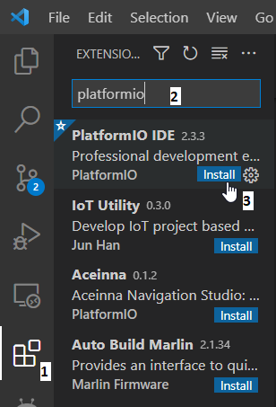

___
## <a name = kontrola>Dálkové ovládání - kontrola robota</a>

V této části nahrajete do TrackJet připravený program pro jeho otestování. Program umožňuje dálkové ovládání TrackJet pomocí tvého chytrého zařízení.

1. Pro naprogramování TrackJet si stáhněte [tento repozitář](https://github.com/vedatori/TrackJet/archive/refs/heads/main.zip). Stáhnutý soubor *TrackJet-main.zip* si rozbalte na disk svého PC na libovolnou lokaci tak, abyste ho našli. 
**Pozor:** PlatformIO nedokáže pracovat s diakritikou v cestě k projektu. Projekt tedy nesmí být součástí složky, která má diakritiku v názvu. Všechny projekty musí být uloženy v cestě bez háčků a čárek!
Pokud vaše uživatelské jméno obsahuje diakritiku, tak nemůžete používat Plochu ani složku Dokumenty, ale musíte vytvořit například *C:/Vedatori/TrackJet-main*.

1. Ve VS Code otevřete nabídku *File*, klikněte na *Open Folder* a zvolte složku *RemoteControl* z dříve rozbalené sbírky příkladů *TrackJet-main*.

    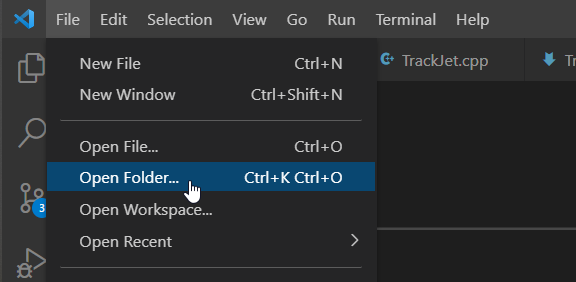
1. Otevřete soubor *main.cpp* který je v cestě *RemoteControl/src/main.cpp*.

    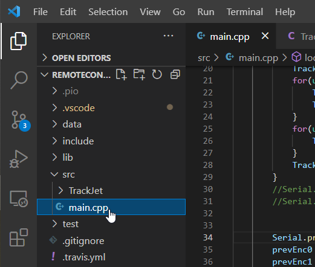
1. V souboru *main.cpp* upravte název robota "<your_name>" tak, aby byl poznatelný, např. jako "MarPta" nebo "MartinP". 
Je možné přidat i heslo pro přihlašování např. takto
"`TrackJet.startWiFiCaptain("<your_name>", "12345678");`".
Heslo musí mít minimálně 8 znaků, jinak nebude použito.

    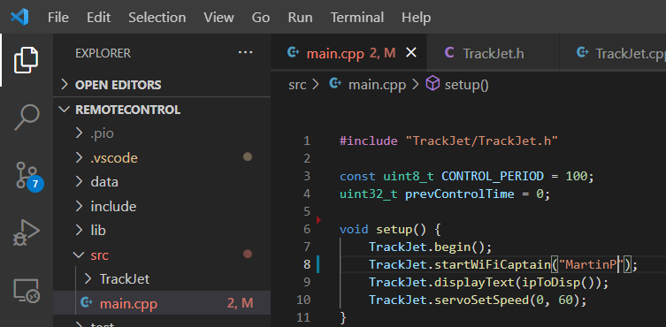
1. Po otevření projektu bude VS Code chvíli pracovat. Pokud ještě pracuje, počkejte, dokud text na dolní liště nezmizí.
   
    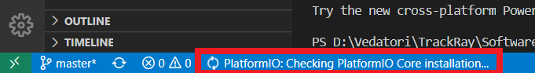
1. Připojte TrackJet pomocí USB-C kabelu k PC.
1. V dolní liště PlatformIO stiskněte šipku a tím nahrejte program do TrackJet.

    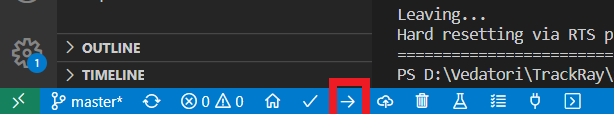
1. Počkejte, až se dokončí nahrávání a zobrazí v dolním terminálu *SUCCESS*.

    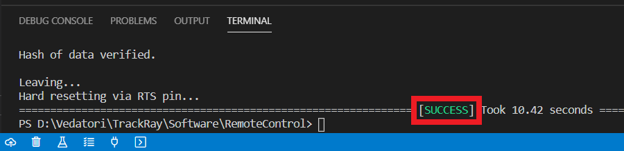
1. V dolní liště PlatformIO stiskněte tlačítko úplně v pravo a tím spusťe PlatformIO terminál.

    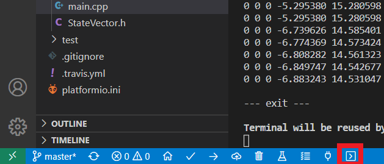
1. Do nově otevřeného termínálu v dolní částí VS Code zadejte příkaz `pio run -t uploadfs` a stiskněte *ENTER*.

    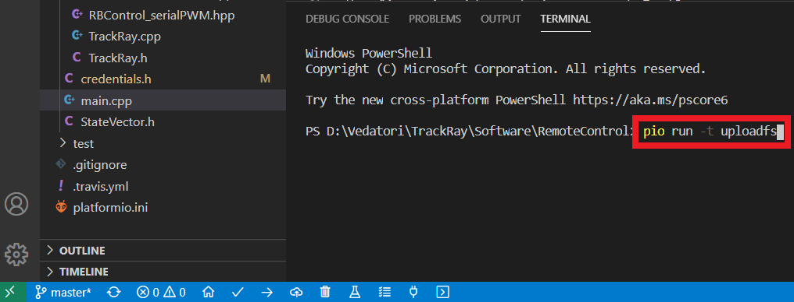
1. Počkejte, až se dokončí nahrávání a zobrazí v dolním terminálu *SUCCESS*.

    
1. Nyní je robot plně naprogramován. Pro ovládání na svém chytrém zařízení vyhledejte WiFi síť s názvem *TrackJet_<your_name>*. Zadejte do webového prohlížeče adresu *192.168.4.1* nebo jakoukoli jinou ve tvaru *www.neco.cz*. Načte se hlavní stránka pro ovládání TrackJet. Joystickem ovládejte pohyb. Na počítači můžete použít i šipky. Do políčka *Command entry* můžete zadávat speciální příkazy.

    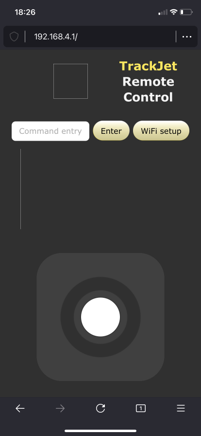
1. Pro přihlášení TrackJet k externí WiFi síti klikněte na tlačítko *WiFi setup*. Na následující stránce zadejte přihlašovací údaje od externí WiFi a potvrďte přihlášení. Poté je potřeba restartovat TrackJet a znovu se k němu připojit.

    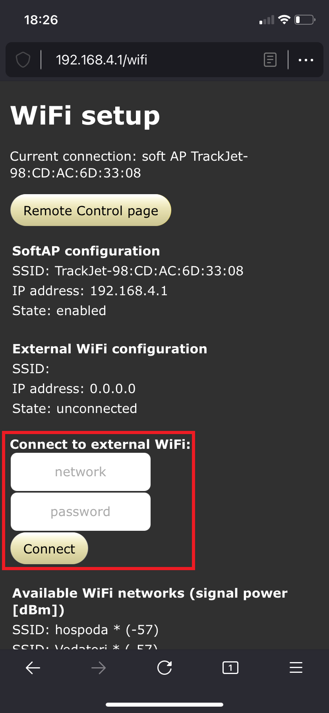
1. Pokud přihlášení k externí WiFi proběhne úspěšně, objeví se potvrzení *connected* a přidělená IP adresa. Tato síť bude uložena a vyhledána i po restartu. Připojte se se svým chytrým zařízením také na externí WiFi a zadejte do prohlížeče IP adresu přidělenou TrackJet. V tomto případě *192.168.88.197*. Tato adresa bude po restartu zobrazena i na LED panelu TrackJet. 

    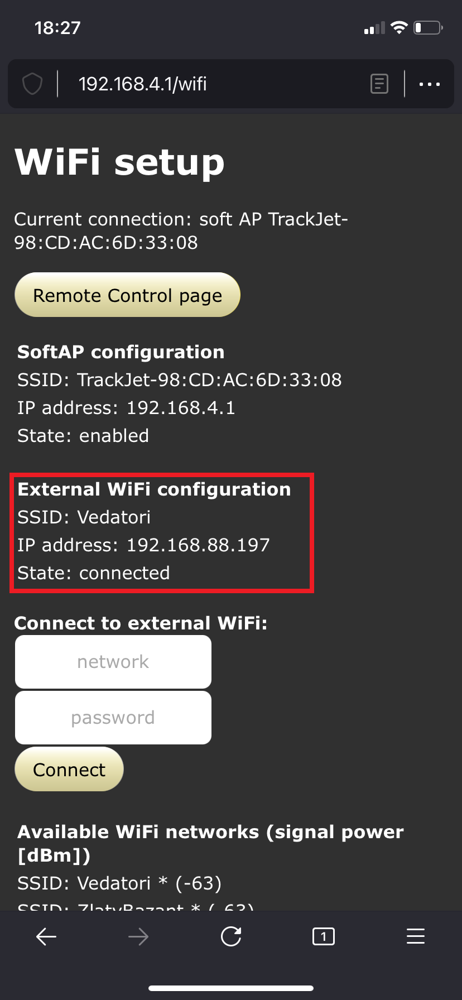
1. Načte se opět hlavní stránka ovládání TrackJet. Tímto je vypnuta interní WiFi *TrackJet_<your_name>*. Pro její opětovné zapnutí přejděte do nastavení WiFi a klikněte na tlačítko *Enable AP* nebo restartujte TrackJet.

    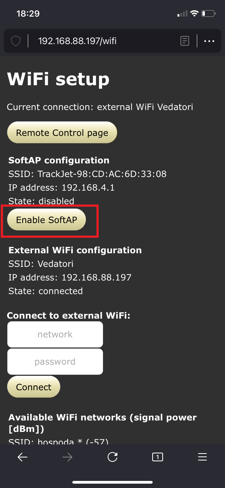
1. Pro ovládání TrackJet s připraveným programem můžete používat následující příkazy. Příkazy nejsou citlivé na velikost použitých písmen.
    * `blade <angle>` - Nastaví výšku radlice na daný úhel serva. 0-dole, 180-nahoře
    * `lidar <angle>` - Nastaví pozici serva LIDARu. 0-vpravo, 180-vlevo
    * `beep` - Zapne buzzer na 0,5 vteřiny

___
## <a name = novyProjekt>Nový projekt</a>

Vytvoříme nový projekt a nahrajeme program do TrackJet.

1. Vytvořte si na disku svého PC složku pro vaše budoucí programy, například *C:/TrackJet-moje-programy*.
1. Do této nové složky překopírujte složku *RemoteControl* ze stáhnutého repozitáře *TrackJet-main*. Tato složka bude sloužit jako šablona tvých budoucích programů pro TrackJet. 
1. Překopírovanou složku *RemoteControl* přejmenuj novým názvem, například na *01_prvni_program*.
1. Ve VS Code otevřete složku *01_prvni_program* pomocí *File*->*Open folder*.
1. Ve VS Code otevřete soubor *main.cpp* a nahraď jeho obsah následujícím kódem šablony:
    ```
    #include "TrackJet/TrackJet.h"

    void setup() {
        TrackJet.begin();
    }

    void loop() {
        
    }
    ```
1. Připojte TrackJet pomocí USB-C kabelu k PC.
1. V dolní liště PlatformIO stiskněte šipku (*Upload*) a tím nahrajte program do TrackJet.
    
1. Počkejte až se dokončí nahrávání a zobrazí v dolním terminálu *SUCCESS*. Nyní je nový program nahrán.
    

___
## <a name = prvniProgram>První program</a>
Rozebereme si každý řádek šablony a napíšeme náš první program.

Zde je kód šablony:
```
#include "TrackJet/TrackJet.h"

void setup() {
    TrackJet.begin();
}

void loop() {
    
}
```

1. `#include "TrackJet/TrackJet.h"` - Příkaz *#include* přidává do našeho programu kód z jiných míst. Nyní nám stačí přidání knihovny *TrackJet.h* ze složky TrackJet.
1. `void setup() {}` - Toto je definice funkce. Funkce jsou kusy kódu, které můžeš opakovaně spustit tak, že zavoláš jméno. Kód (tělo) funkce je ohraničen složenými závorkami { a }, a mezi nimi odsazen. Tato funkce se jmenuje *setup* a je spuštěna jedenkrát po zapnutí TrackJet. O to se postará arduino-esp32 framework.
1. `TrackJet.begin();` - Toto je volání funkce z knihovny *TrackJet*, která knihovnu inicializuje a připraví všechny její komponenty pro budoucí použití. Toto je třeba provést pouze jednou po startu robota, proto je příkaz umístěn ve funkci *setup*.
1. `void loop()` - Toto je definice funkce *loop*. Ta je spouštěna stále pořád dokola dokud je TrackJet zapnutý.

### Váš kód
Nyní napíšete svůj první vlastní program pro TrackJet. Na konec funkce *setup* připiště `TrackJet.ledWrite(1, true);`, tedy nad uzavírací závorku }. Tento příkaz zapříčiní, že se LED číslo 1 rozsvítí.

Všimněte si, že při psaní vám VS Code napovídá. Stačí napsat `TrackJet.` a uvidíte nabídku připravených funkcí z knihovny *TrackJet*. Pokud se tak nestane, nabídku vyvoláte stisknutím *Ctrl + Space*.

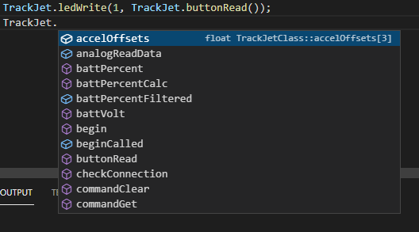


Funkce *ledWrite* slouží k zapínání a vypínání LED světel na TrackJet. Jedná se o volání funkce s parametry v kulatých závorkách ( a ).
1. parametr udává, kterou LED chceme ovládat. V tomto případě budeme ovládat první LED, která se jmenuje *D1*.
1. parametr udává, jestli má LED od nyní svítit (`true`) nebo nesvítit (`false`).

Nahrajte program do TrackJet a počkejte, až se první LED rozsvítí. Gratulujeme, toto byl váš první vlastní program pro TrackJet :-)

___
## <a name = komentare>Komentáře</a>

Do svého kódu je někdy vhodné psát komentáře. Komentáře jsou kusy textu, které jsou viditelné pro programátora, čili vás, ale TracJet si jich nevšímá (ani se do něj nenahrají). Jsou vhodné zejména v místech, kdy ze samotného funkčního kódu není zřejmé, co dělá a k čemu slouží.

V jazyce C++ máme 2 typy komentářů:
1. Jenořádkový komentář je uvozen dvojitým lomítkem `//`. Celý zbytek řádku za dvojitým lomítkem je považován za komentář.
1. Víceřádkový komentář je uvozen lomítkem a hvězdičkou `/*`. Ukončen je hvězdičkou a lomítkem `*/`. Veškerý text mezi je považován za komentář. Začátek a konec mohou být na různých řádcích.

Příklad: Tento program nerozsvítí LEDku.
```
#include "TrackJet/TrackJet.h"

void setup() {
    TrackJet.begin();
    //TrackJet.ledWrite(1, true);
}

void loop() {
    
}
```

___
## <a name = promenne>Proměnné</a>

### Motivace
Při psaní programů brzy dojdete k tomu, že potřebujete, aby si program něco *zapamatoval*. Může se jednat o výsledek matematicé operace, počítadlo kroků, uchování měřené hodnoty a tak dále. K tomuto účelu se v programech používají **proměnné**. Proměnné si můžeme představovat jako šuplíky s textovými popisky na sobě. Do šuplíku můžeme *vložit* nějakou informaci a někdy později ji opět vytáhnout. Popisek šuplíku zde představuje název proměnné.

### Vytvoření proměnné
Proměnnou vytvoříme následujícím příkazem:
```
typ_promenne nazev_promenne = hodnota;
```
`typ_promenne` udává jaký typ informace budeme do proměnné ukládat. Říkáme mu také *datový typ proměnné*. Může to být číslo, text atd.

`nazev_promenne` udává název proměnné, pomocí kterého dokážeme od sebe jednotlivé proměnné odlišit. Proto musí mít každá proměnná svůj jedinečný název. Snaž se pojménovávat proměnné výstižně, tedy např. *rychlost* je mnohem lepší než *prom*. V názvu proměnné můžeš používat znaky anglické abecedy, tj. bez diakritiky, velká a malá písmena, čísla a speciální znaky jako podrtžítko `_`. Podtžítkem můžeme oddělovat slova v názvu jedné proměnné.

`=` je operátor sloužící k přiřazení (vložení) určité hodnoty do proměnné.

`;` čili středník slouží k oddělování příkazů a píšeme ho vždy na konec příkazu. Na české klávesnici se nachází pod klávesou *ESC* vlevo nahoře.

### Základní datové typy proměnných
* `int` označuje proměnnou pro ukládání celých čísel, například `3`.
* `float` označuje proměnnou pro ukládání desetinných čísel, například `3.14`.
* `char` označuje jeden textový znak -> znak se udává v apostrofech, například `'c'` označuje znak *c*.
* `bool` označuje pravdivostní hodnotu -> *true* pro pravdu a *false* pro nepravdu.
* `std::string` označuje řetězec textových znaků -> řetězec se ohraničuje uvozovkami, například `"Ahoj svete"`.

### Operace s proměnnými

Operace *přiřazení* slouží k uložení dané hodnoty do proměnné. Hodnota, která je napravo od rovnítka `=` je uložena do proměnné uvedené nalevo od `=`: 
```
nazev_promenne = hodnota;
```

Číselné proměnné můžeme sčítat (+), odečítat (-), násobit (*) a dělit (/). 

Příklad:
```
#include "TrackJet/TrackJet.h"

void setup() {
    TrackJet.begin();
    int cele_cislo = 0;
    cele_cislo = cele_cislo + 10;   // Zvýšíme hodnotu v proměnné o 10
    cele_cislo += 10;   // Zkrácený zápis stejné operace jako výše
    // Nyní je v proměnné cele_cislo uložena hodnota 20
}

void loop() {
    
}
```

Zde jsou uvedeny příklady vytvoření proměnných zmíněných datových typů a uložení hodnoty do nich.
```
// proměnná pro celá čísla se jménem cele_cislo, ve které je hodnota 0
int cele_cislo = 0; 

// promenna pro desetinne cislo ve které je hodnota 3.14
float desetinne_cislo = 3.14; 

// proměnná znak, do které jsme uložili znak 'a'
char znak = 'a';

// proměnná otevreno, do které jsme uložili hodnotu pravda (true)
bool otevreno = true; 

// proměnná pro textový řetězec s hodnotou "nejaky text"
String text = "nejaky text";
```
___
## <a name = podminky>Podmínky</a>

### Motivace
Při programování brzo zjistíte, že potřebujete, aby se váš program choval různě v různých situacích. Jinými slovy aby prováděl určité úseky kódu pouze za splnění daných podmínek. K tomu se používají *podmínky*. Ty umožňují programu provádět *rozhodnutí*.

### Konstrukce `if`
`if` je základní podmínka. Základem této konstrukce je *podmínka*, která se uvádí za `if` do kulatých závorek. Podmínka může být proměnná nebo logický výraz.
```
if(podminka) {
    ...kód který se provede, pokud je podmínka splněna (true)...
}
```
U `if` konstrukce docházi k vyhodnocení podmínky, tj. zjistí se, zda je podmínka pravdivá (`true`) nebo nepravdivá (`false(`). Pokud je pravdivá, provede se kód, který je za `if` uveden ve složených závorkách `{...kód...}`. V opačném případě program pokračuje až za `if`.

### Konstrukce `else`
Může existovat jen v případě, že před ní byl uvedený `if`. Úkolem `else` je provést kód v něm napsaný jen v případě, že předchozí `if` nebyl splněn.
```
if(podminka) {
    ...kód který se provede, pokud je podmínka splněna (true)...
}
else {
    ...kód který se provede, pokud není podmínka splněna (false)...
}
```

### Konstrukce `else if`
Pokud chceme postihnout více možných příapadů než dva dříve zmíněné (`true` a `false`), použijeme konstrukci `else if`.
```
if(podminka_1) {
    ...kód který se provede, pokud je podmínka 1 splněna (true)...
}
else if(podminka_2) {
    ...kód který se provede, pokud je podmínka 2 splněna (true)...
}
else {
    ...kód který se provede, pokud není podmínka 1 ani 2 splněna (false)...
}
```

Poznámka: V jednotlivých konstrukcích větvení je možné libovolně vnořovat další konstrukce větvení.

### Podmínka
Podmínka dotazovaná při větvení určuje zda se bude daný úsek kódu provádět. K tomu je porovnávána s logickými hodnotami `true` a `false`. Tato hodnota může být uložena v pravdivostní proměnné typu `bool`:
```
bool podminka = true;
if(podminka) {
    ...kód je vykonán, protože podmínka je pravdivá...
}
```

K vytvoření podmínky z číselné hodnoty budeme používat tzv. *relační operátory*:
* `==` označuje porovnávání, takže 1 == 1 označuje, že se 1 rovná 1
* `!=` vykřičník před rovnítkem označuje opak, tudíž tento operátor značí nerovnost, tedy 1 != 2 označuje, že se 1 nerovná 2
* `<` menší než
* `>` větší než
* `<=` menší nebo rovno než
* `>=` větší nebo rovno než
Výsledek výrazu s relačními operátory nabývá hodnotu pravda `true` nebo nepravda `false`.
Příklad relačního operátoru:
```
int cele_cislo = 3;
if(cele_cislo < 5) {
    if (cele_cislo > -5) {
        cele_cislo = 0;
    }
}
// V proměnné cele_cislo je uložena hodnota 0, protože obě podmínky byly splněny
```

### Propojování podmínek
Podmínky je možné propojovat do jedné složitější pomocí logických operátorů. Jsou jimi
* `&&` (logické *A*) říká nám, že musí platit obě podmínky, aby byla podmínka splněna, jinak je nesplněna
* `||` (logické *NEBO*) říká nám, že musí platit alespoň jedna podmínka z nich, aby byla podmínka splněna, jinak je nesplněna
Ukázka: Následující program funguje stejně jako předchozí, používá ovšem využívá logické operátory.
```
int cele_cislo = 3;
if(cele_cislo < 5 && cele_cislo > -5) {
    cele_cislo = 0;
}
// V proměnné cele_cislo je uložena hodnota 0, protože obě podmínky byly splněny
```
___
## <a name = cyklus>Cyklus</a>

### Motivace
Při programování se nám často stane, že potřebujeme některé úkony vykonat vícekrát. Případně vykonat velké množství podobných úkonů. K tomuto budeme používat *cykly*, které nám umožní opakovaně vykonávat úseky kódu.

Pro jedno bliknutí LEDkou poslouží tento program:
```
#include "TrackJet/TrackJet.h"

void setup() {
    TrackJet.begin();
    TrackJet.ledWrite(1, true);
    delay(500);
    TrackJet.ledWrite(1, false);
    delay(500);
}

void loop() {
    
}
```
V tomto programu používáme příkaz *delay()* pro čekání na místu v kódu o určitý čas. Tento čas čekání je určen v milisekundách (1000 ms = 1s).

Pro 3 bliknutí LEDkou poslouží tento program, ve kterém jsme pouze zopakovali příkazy z minulého:
```
#include "TrackJet/TrackJet.h"

void setup() {
    trrBegin();
    TrackJet.ledWrite(1, true);
    delay(500);
    TrackJet.ledWrite(1, false);
    delay(500);

    TrackJet.ledWrite(1, true);
    delay(500);
    TrackJet.ledWrite(1, false);
    delay(500);

    TrackJet.ledWrite(1, true);
    delay(500);
    TrackJet.ledWrite(1, false);
    delay(500);
}

void loop() {
    
}
```

Ale co kdybychom chtěli bliknout 1000 krát? Kód by nás přerostl. Cykly nám pomohou tento problém vyřešit. 

### Cyklus `while`
Cyklus `while` použijeme v případě, kdy předem nevíme, kolikrát chceme kód opakovat. Cyklus `while` se opakuje dokud je splněna jeho podmínka (`true`).
```
while(podminka){
    ...Co se ma provest pri kazdem opakovani...
}
```

V následném kódu budeme blikat LEDkou dokud bude TrackJet zapnutý:
```
while(true){
    TrackJet.ledWrite(1, true);
    delay(500);
    TrackJet.ledWrite(1, false);
    delay(500);
}
```

### Cyklus `for`
Cyklus `for` použijeme v případě, kdy dopředu známe, kolikrát chceme kód opakovat. Cyklus `for` má následující formu:
```
for(vytvoreni_promenne; podminka; operace){
    ...Co se ma provest pri kazdem opakovani...
}
```

Oproti cyklu while je zde podmínková část složitější. Skládá se ze 3 částí:
* Vytvoř proměnnou, kterou využiješ v podmínce
* Zadej podmínku, která bude udávat, do kdy máme kód opakovat
* Uprav hodnotu proměnné, pokud je podmínka splněna

Následující program ukazuje, jak bliknout 10x s LED číslo 1 pomocí cyklus `for`.
```
for(int pocet_bliku = 0; pocet_bliku < 10; pocet_bliku++){
    TrackJet.ledWrite(1, true);
    delay(500);
    TrackJet.ledWrite(1, false);
    delay(500);
}
```
Vytvořili jsme proměnnou `pocet_bliku`, která obsahuje celé číslo 0. Dokud je hodnota této proměnné menší než 10, zvýší se její hodnota 1 a provede se kód uvnitř cyklu. Jakmile hodnota proměnné rovna 10, cyklus se ukončí a program pokračuje směrem dolů.

<!---
___
## <a name = funkce>Funkce</a>
**TODO**
-->

___
## <a name = ledky>LEDky</a>
V této kapitole si pořádně ukážeme ovládání LEDek na TrackJet.

Pro ovládání samostatných LED pod panelem TrackJet použijeme funkce:
* `TrackJet.ledWrite(state)` - rozsvícení a zhasnutí jedné LED. Parametr `state` je 0-nesvítí, 1-svítí.
* `TrackJet.ledWriteAnalog(brightness)` - nastavení jasu jedné LED. Parametr `brightness` je v rozsahu 0-nesvítí až do 100-plně svítí.

Pro ovládání LED na panelu TrackJet použijeme následující funkce:
* `TrackJet.displaySingle(row, col, state);` - rozsvícení a zhasnutí jedné LED na panelu. Parametr `row` udává číslo řádku v rozsahu 0-nahoře po 7-dole. Parametr `col` udává číslo sloupce v rozsahu 0-vlevo po 7-vpravo. Parametr `state` je 0-nesvítí, 1-svítí.
* `TrackJet.displaySingleAnalog(row, col, brightness);` - nastavení jasu jedné LED na panelu. Parametr `row` udává číslo řádku v rozsahu 0-nahoře po 7-dole. Parametr `col` udává číslo sloupce v rozsahu 0-vlevo po 7-vpravo. Parametr `brightness` je v rozsahu 0-nesvítí až do 12-plně svítí.
* `TrackJet.displayAll(brightness)` - nastavení jasu všech LED na panelu. arametr `brightness` je v rozsahu 0-nesvítí až do 12-plně svítí.

Například pro rozsvícení LED na panelu vlevo dole použijeme příkaz:
```
TrackJet.displaySingle(7, 0, true);
```
Stejně tak můžeme pro rozsvícení použít příkaz:
```
TrackJet.displaySingleAnalog(7, 0, 12);
```
___
## <a name = tlacitko>Tlačítko</a>
Nejjednodušším způsobem, jak můžete TrackJet ovládat je pomocí tlačítka **SW1**, které najdete v pravém horním rohu desky elektroniky. Pro zjištění jestli je tlačítko zmáčknuto budeme používat příkaz `TrackJet.buttonRead` v náslející konstrukci.
```
bool tlacitko_zmacknuto = TrackJet.buttonRead();
```
Zde je vytvořena proměnná `tlacitko_zmacknuto` a následně do ní uložen stav tlačítka voláním příkazu `TrackJet.buttonRead`, který nabývá pravdivostní hodnoty `true` nebo `false`.

Příklad: Tento program rozsvítí LED 1 pod panelem při stisku tlačítka SW1.
```
#include "TrackJet/TrackJet.h"

void setup() {
    TrackJet.begin();
}

void loop() {
    if(TrackJet.buttonRead()) {
        TrackJet.ledwWrite(1, true);
    }
    else {
        TrackJet.ledWrite(1, false);
    }
}
```

Protože příkaz `TrackJet.buttonRead` nabývá pravdivostní hodnoty `true` nebo `false`, můžeme předchozí program zapsat úsporněji, ale funkčně stejně:
```
#include "TrackJet/TrackJet.h"

void setup() {
    TrackJet.begin();
}

void loop() {
    TrackJet.ledWrite(1, TrackJet.buttonRead());
}
```

___
## <a name = potenciometr>Potenciometr</a>
Dalším způsobem, jak můžete TrackJet ovládat je pomocí potenciometru **RV1**, který najdete v levém horním rohu desky elektroniky. Pro zjištění stavu potenciometru budeme používat příkaz `TrackJet.potentiometerRead`. Tento příkaz vrací hodnotu `0` až `100` podle natočení potenciometru.

Příklad: Tento program řídí jas LED podle natočení potenciometru.
```
#include "TrackJet/TrackJet.h"

void setup() {
    TrackJet.begin();
}

void loop() {
	// Vytvoření celočíselné proměnné
	int jas = 0;
	
	// Přečtení stavu potenciometru (0-100) a uložení do proměnné
	jas = TrackJet.potentiometerRead();
	
	// Nastavení jasu LED1 podle stavu proměnné
	TrackJet.ledWriteAnalog(1, jas);

    delay(100);
}
```

Protože příkaz `TrackJet.potentiometerRead` vrací celočíselnou hodnotu od `0` do `100`, můžeme předchozí program zapsat úsporněji, ale funkčně stejně.
___
## <a name = seriovka>Sériová linka</a>

### Motivace
Při programování robotů se často stane, že potřebujete s programem v robotovi komunikovat. Například když se snažíte odhalit chybu, vypisovat hodnotu senzorů nebo informovat uživatele o ději v programu. Pro tento účel nám poslouží sériová linka.

### Program pro výpis textu na sériové lince
Pro výpis textu na sériové lince budeme používat příkaz `printf`. Abyste na sériové lince jedenkrát vypsali text *Hello World!*, použijte následující program:
```
#include "TrackJet/TrackJet.h"

void setup() {
    TrackJet.begin();
}

void loop() {
    printf("Hello World!\n");
    delay(1000);
}
```
Okolo textu, který chceme vypsat, je třeba vložit dvojité uvozovky `"text"`. Řetězec `\n` označuje znak pro odřádkování, čili obdoba tlačítka *ENTER* v textových editorech. 

### Spuštění sériové linky
1. Po nahrání programu do TrackJet necháme TrackJet zapnutý a připojený USB kabelem k PC.
1. Pomocí tlačítka v levé dolní liště PlatformIO ve tvaru zásuvky spustíme sériovou linku.

    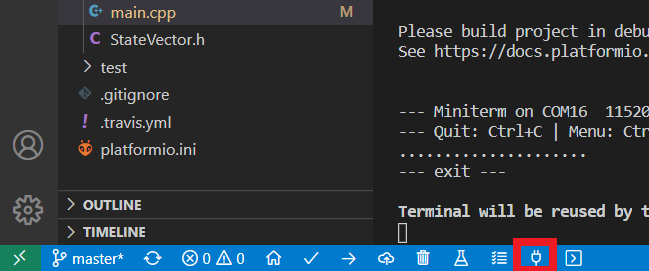
1. V monitoru sériové linky v dolní částí okna VS Code najdete příchozí zprávy z TrackJet. Uvidíte, že každou vteřinu přijde nová zpráva ve tvaru *Hello World!*, vždy na novém řádku:
    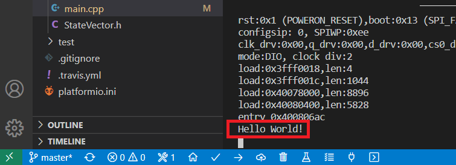

### Výpis hodnot proměnných
Často potřebujeme vypsat i hodnotu některé z našich proměnných. V tomto případě můžeme použít takzvaná formátovací direktiva. V textu začínají znakem `%`:
* %d - (decimal) označuje celé číslo
* %f - (float) značí desetinné číslo
* %c - (char) označuje znak
* %s - (string) značí řetězec 

Pro úpravu formátu vypisovaných proměnných máme mnoho dalších možností, které jsou například na [Wiki](https://cs.wikipedia.org/wiki/Printf#Form%C3%A1tovac%C3%AD_%C5%99et%C4%9Bzec). Pro výpis celočíselné proměnné `cele_cislo` do sériové linky použijeme následující příkaz:
```
printf("%d\n", cele_cislo);
```

Příklad: Pro opakovaný výpis času od startu TrackJet použijeme následující program. Hodnota času je uvedena v milisekundách:
```
#include "TrackJet/TrackJet.h"

void setup() {
    TrackJet.begin();
}

void loop() {
    printf("%d\n", millis());
    delay(1000);
}
```
Funkce `millis()` nám vrací počet uplynulých milisekund od startu TrackJet jako celé číslo.

___
## <a name = motory>Motory</a>
Nyní konečně pořádně oživíme TrackJet a začneme s ním jezdit.

Pro řízení motorů můžete použít příkaz `TrackJet.motorSetSpeed(index, speed)`. *index* určuje, který motor ovládáme. Indexy motorů odpovídají popiskům na desce elektroniky. TrackJet disponuje následujícími motory:
* Index 1: motor levého pásu. Točí se na obě strany. Rozsah *speed* -100 až 100 (dopředu). Max. napětí 10V.
* Index 2: motor pravého pásu. Točí se na obě strany. Rozsah *speed* -100 až 100 (dopředu). Max. napětí 10V.
* Index 3: volný konektor. Točí se jednosměrně. Rozsah *speed* 0 až 100. Max. napětí 10V.
* Index 4: volný konektor. Točí se jednosměrně. Rozsah *speed* 0 až 100. Max. napětí 5V.
* Index 5: volný konektor. Točí se jednosměrně. Rozsah *speed* 0 až 100. Max. napětí 10V.
* Index 6: volný konektor. Točí se jednosměrně. Rozsah *speed* 0 až 100. Max. napětí 5V.

Příklad: Následujícími příkazy rozjedeme TrackJet na poloviční rychlost dopředu:
```
TrackJet.motorSetSpeed(1, 50);
TrackJet.motorSetSpeed(2, 50);
```

___
## <a name = enkoder>Enkodér</a>
Enkodérem budeme mírně nepřesně nazývat otočný ovládací prvek podobný potenciometru. Na rozdíl od něj se však otáčí v krocích a umí se točit nepřetržitě dokola. Pro zjištění o kolik kroků byl od startu TrackJet otočen, zavoláme funkci `TrackJet.encoderRead()`. Pokud budeme chtít začít s počítáním kroků od znova, zavoláme funkci `TrackJet.encoderReset()`, která vrátí vracenou hodnotu zpět do nuly. 

Enkodér v sobě integruje další tlačítko. Jeho stav zjistíme zavoláním funkce `TrackJet.encoderReadButton()`, která vrátí *true*, když je zmáčknut a *false* když ne.

___
## <a name = serva>Serva</a>
TrackJet má 3 sloty pro servomotory s indexy:
* Index 1: servo radlice
* Index 2: servo LIDARu
* Index 3: volný konektor

Pro nastavení polohy serva použijeme funkci `TrackJet.servoSetPosition(index, pozice)`, kde *index* popisuje, které servo chceme nastavit, a *pozice* popisuje žádanou polohu serva, čili úhel v rozsahu 0-180.

Standardně jsou serva nastavena na plnou rychlost pohybu, tj. 600°/s. Pokud chceme, aby se pohybovalo pomaleji, můžeme tuto rychlost snižit funkci `TrackJet.servoSetSpeed(index, rychlost)`. Zde *rychlost* značí nastavenou rychlost pohybu serva v rozsahu 0-600°/s.

___
## <a name = lidar>LIDAR</a>
Pro zjištění měřené vzdálenosti od překážky senzorem LIDAR použijeme funkci `TrackJet.lidarDistance()`. Ta nám vrátí celé číslo udávající počet milimetrů od překážky. 

___
## <a name = panelLed>Výpis textu na LED panel</a>
Pro ukázání jedné celé číslice na panelu TrackJet použijeme funkci `TrackJet.displayDigit(cislo)`, kde *cislo* je celočíselná proměnná v rozsahu 0-9. Pro zobrazení číslice *4* tedy použijeme `TrackJet.displayDigit(4)`.

Pro ukázaní jednoho znaku na panelu TrackJet použijeme funkci `TrackJet.displayChar(znak)`, kde *znak* je proměnná typu *char*. Pro zobrazení znaku *a* tedy použijeme `TrackJet.displayChar('a')`. Tímto způsobem můžeme zobrazovat i číslovky jako v předchozím případě nebo i velká písmena. Přidáním nepovinných parametrů *posunVpravo* a *posunDolu* ve variantě příkazu `TrackJet.displayChar(znak, posunVpravo, posunDolu)` můžeme znak posunovat po obrazovce. Přidané parametry udávají v celých číslech, o kolik LED bude znak posunut.

Pro výpis delšího textu na panel TrackJet slouží funkce `TrackJet.displayText(text)`. Ta postupně vypíše zadaný *text* z proměnné typu *String*. Pro vypsání textu *ahoj* tedy použijeme `TrackJet.displayText("ahoj")`. V základní variantě odjíždí text postupně doleva z panelu. Pro postupné vypsání jednotlivých znaků textu bez posunu přidejte nepovinný binární parametr v hodnotě *false*, tedy `TrackJet.displayText("ahoj", false)`.

Funkce pro postupný výpis více zpráv se bude hodit funkce `TrackJet.displayIsBusy()`. Ta vrací pravdivostní hodnotu (*true* nebo *false*) označující jestli je aktuálně vypisován v minulosti zadaný text.

Příklad: Následující program při startu vypíše text "TrackJet is starting" v pohyblivém módu textu.
```
#include "TrackJet/TrackJet.h"

void setup() {
    TrackJet.begin();
    TrackJet.displayText("TrackJet is starting");
}

void loop() {
    delay(500);
}
```

___
## <a name = buzzer>Bzučák</a>

Pro ovládání bzučáku slouží funkce `TrackJet.soundTone(frekvence)`, kde parametr *frekvence* značí frekvenci zvuku v jednotce Hertz (Hz nebo 1/s). Tento tón bude hrát do té doby, dokud TrackJet nevypnete nebo nezavoláte funkci `TrackJet.soundEnd()`.

Pro tvoření melodie je vhodné použít funkci `TrackJet.soundNote(tón, oktáva)`. Zde je třeba zadat parametr *tón* ve formátu `NOTE_C`, kde měníme poslední písmeno na jiný tón. Druhý parametr *oktáva* udává, ze které oktávy nastavený tón bude.

___
## <a name = cara>Senzor čáry</a>
TrackJet má na své spodní straně 2 infračervené reflexní senzory, které umí měřit světlost povrchu pod ním. To se může hodit když chceme, aby jel TrackJet po čáře. Čára musí být v takovém případě kontrastní k povrchu.

Pro zjištění hodnoty světlosti povrchu zavoláme funkci `TrackJet.lineRead(index)`, kde *index* v hodnotě 1 značí levý senzor a v hodnotě 2 pravý senzor, podobně jako u motorů. Tato funkce vrátí hodnotu v rozsahu 0-100, kde 0 odpovídá tmavšímu povrchu a 100 odpovídá světlejšímu povrchu.

___
## <a name = wifi>WiFi</a>
Pro spuštění WiFi a ovládací webové aplikace slouží funkce `TrackJet.startWiFiCaptain("<your_name>")`. Po jejím zavolání bude postaráno o vytvoření WiFi přístupového bodu (AP) v TrackJet a také o připojní k externí WiFi, jakmile má TrackJet správné přihlašovací údaje a je v dosahu. Také je spuštěn server hostující webovou aplikaci pro dálkové ovládání TrackJet.

___
## <a name = remoteCmd>Vzdálený příkazový řádek</a>
Pro dálkové ovládání TrackJet můžete použít i textové příkazy. Ty budete zadávat do pole *Command entry* na webové stránce dálkového ovládání. Po stisku tlačítka *Enter* (funguje i na klávesnici) je zadaný příkaz odeslán do TrackJet. K použítí přijatého příkazu budeme používat následující funkce:
* `TrackJet.commandGet()` - vrací textový řetězec (proměnnou typu *String*) obsahující aktuálně přijatý příkaz.
* `TrackJet.commandGetIndexed(index)` - vrací textový řetězec obsahující jedno slovo z přijatého příkazu. Slova jsou oddělena mezerami a číslována od 0.
* `TrackJet.commandClear()` - vymaže obsah celého aktuálně přijatého příkazu.

Příklad: Následující program pípne bzučákem na frekvenci 1kHz po 0,5 sekundy po obdržení příkazu "beep":
```
#include "TrackJet/TrackJet.h"

void setup() {
    TrackJet.begin();
    TrackJet.startWiFiCaptain("<your_name>");
}

void loop() {
    if(TrackJet.commandGet() == "beep") {
            TrackJet.soundTone(1000);
            delay(500);
            TrackJet.soundEnd();
            TrackJet.commandClear();  // nutné jinak bude v paměti pořád příkaz "flash" a LED bude pořád svítit
        }
    delay(100);
}
```

Příklad: Následující program spustí bzučák na příkaz "buzzer on" a vypne ho na příkaz "buzzer off":
```
#include "TrackJet/TrackJet.h"

void setup() {
    TrackJet.begin();
    TrackJet.startWiFiCaptain("<your_name>");
}

void loop() {
    if(TrackJet.commandGetIndexed(0) == "buzzer") {
        if(trrCommandGetIndexed(1) == "on") {
            TrackJet.soundTone(1000);
        }
        else if(trrCommandGetIndexed(1) == "off") {
            TrackJet.soundEnd();
        }
        TrackJet.commandClear();
    }
    delay(100);
}
```

TrackJet umožňuje textovou komunikaci i opačným směrem, tedy z TrackJet do webové stránky dálkového ovládání.
* `TrackJet.commandSend(command)` - odešle textový příkaz *command* z TrackJet a zobrazí ho šedě v poli *Command entry*.

Příklad: Následující program bude v textovém poli *Command entry* vypisovat stav tlačítka TrackJet:
```
#include "TrackJet/TrackJet.h"

void setup() {
    TrackJet.begin();
    TrackJet.startWiFiCaptain("<your_name>");
}

void loop() {
    TrackJet.commandSend(String(TrackJet.buttonRead()));
    delay(500);
}
```

___
## <a name = odometr>Měření ujeté vzdálenosti</a>
TrackJet je vybaven senzory ujeté vzdálenosti, které nazýváme mírně slangově *enkodéry*. Fungují na principu optické brány, kde je paprsek světla přerušován vnitřními výstupky pásu. Tímto způsobem je možné získat celočíselnou proměnnou, která je zvýšena o 4 při každém posunu pásu o jeden celý segment. Aby enkodéry správně fungovaly, je třeba je zkalibrovat. K tomu je třeba přes vzdálený příkazový řádek zadat `encoder calibrate`. Po zadání bude probíhat kalibrace po dobu 5 sekund. Během této doby je nutné, aby se oba pásy pootočily o několik segmentů. Poté je kalibrace hotova a uložena. 

Celočíselnou proměnnou udávající ujetouo vzdálenost získáme zavoláním funkce `TrackJet.encoderGetSteps(index)`, kde *index* je 1 pro levý pás a 2 pro pravý pás, podobně jako u motorů. 

Pro získání ujeté vzdálenosti daného pásu použijeme funkci `TrackJet.encoderGetDistance(index)`, která nám vrátí ujetou vzdálenost daného pásu vyjádřenou v milimetrech jako desetinné číslo.