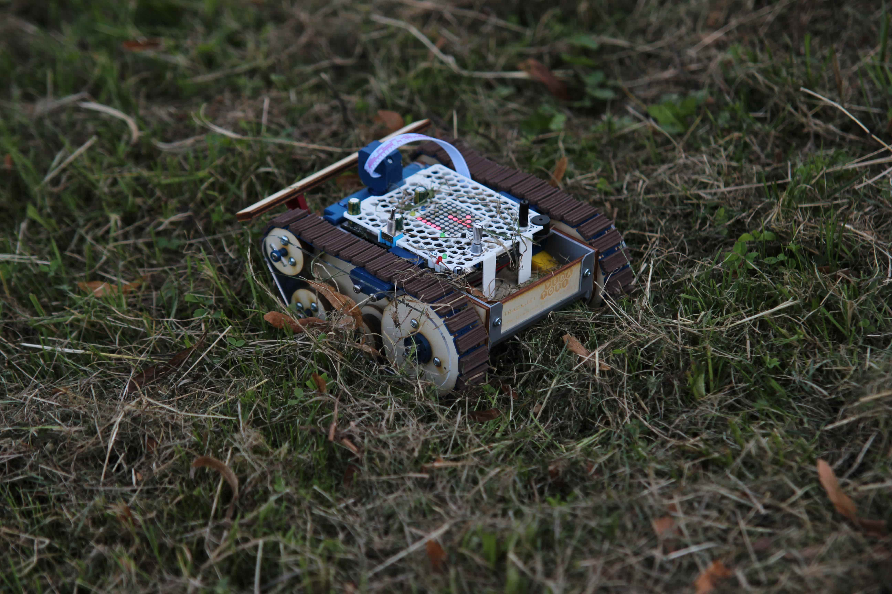

# TrackJet (cz)
TrackJet je otevřená platforma robotického vozidla vyvinutá pro [Robotický tábor 2021](http://wp.vedatori.com/pobytove-tabory/) organizovaný spolkem [Vědátoři](http://wp.vedatori.com/). Jedná se o nástupní verzi vozidla [TrackRay](https://github.com/vedatori/TrackRay), ve které byly vylepšeny jeho terénní schopnosti a přidány nové funkcionality. Byla redesignována mehanická konstrukce i řídicí elektronika, pro kterou byl vyvinut odpovídající software. 

Hlavní mechanickou částí je 3D tištěné šasi, které je doplněno dalšími 3D tištěnými díly. Plošné díly jsou laserem vyřezány z překližky. Spojování je prováděno především šrouby M3. Je použito minimum lepených spojů tak, aby bylo možné vrátit jakýkoliv krok při stavbě. Obsahuje zadní pohonná kola a na každé straně dále tři kola pro vedení pásu. Všechna kola jsou uložena pevně. Pásy jsou vytištěny na 3D tiskárně tak, aby se již při tisku vytvořilo kloubové spojení jednotlivých segmentů, což vede ke snížení času potřebného pro stavbu.

Veškerá elektronika je umístěna na jedné DPS. Ze spodní strany je připevněn zdroj energie - akumulátor 18650. Jeho nabíjení je řešeno na DPS, pro nabití není nutné ho vyjmout. Robota řídí ESP32 připájené přímo do DPS. Pro orientaci v prostoru robot využívá snímání pohybu pásů pomocí optických enkodérů a senzoru LiDAR umístěného na otočné konzoli. Vstupy od uživatele je možné zadat pomocí rotačního enkodéru, potenciometru a tlačítka, výstupy jsou zobrazeny na LED matici, bzučákem nebo jiných LED. Programování a nabíjení robota je prováděno přes USB-C.

Software je připraven na výuku programování. Tomu je přizpůsobena knihovna, pomocí které uživatelé jednoduše ovládají periferie robota bez nutnosti nízkoúrovňového programování jednotlivých částí. Pro výuku programování je připraven také návod popisující jednotlivé funkce a příklady jejich použití. Vše bylo navrženo s důrazem na rozvoj schopností algoritmizace a programování účastníků.
Součástí softwarového balíku je i kompletní program pro dálkové ovládání přes WiFi. Vozidlo umožňuje komunikaci jak přes vlastní WiFi, tak přihlášení k již existující síti. To mu umožňuje jízdu i v širém prostoru. TrackJet můžete vidět v akci v [tomto videu](https://www.youtube.com/watch?v=zHig3jCnhBY).

Při stavbě TrackJet postupujte podle připravených návodů v následujícím pořadí:
1. [Návod pro mechaniku](https://github.com/vedatori/TrackJet/blob/main/Manuals/TrackJet_mechanics_cz.md)
1. [Návod pro elektroniku](https://github.com/vedatori/TrackJet/blob/main/Manuals/TrackJet_electronics_cz.md)
1. [Návod pro programování](https://github.com/vedatori/TrackJet/blob/main/Manuals/TrackJet_programming_cz.md)

## Licence
* Obsah tohoto repozitáře mimo složku *Software* je sdílen pod licencí [Attribution-NonCommercial-ShareAlike 4.0 International (CC BY-NC-SA 4.0)](https://creativecommons.org/licenses/by-nc-sa/4.0/).
* Obsah složky *Software* je sdílen pod licencí [GNU Lesser General Public License v3.0](https://www.gnu.org/licenses/lgpl-3.0.en.html).

# TrackJet (en)

TrackJet is an open-source robotic vehicle platform developed for the [Robotic camp 2021 (cz)](http://wp.vedatori.com/pobytove-tabory/) organized by [Vědátoři (cz)](http://wp.vedatori.com/) society. It is a succesor of [TrackRay](https://github.com/vedatori/TrackRay) robotic vehicle. TrackJet introduces enhanced terrain abilities and new functionalities. Mechanical parts, electronics and software were redesigned.

TrackJet consists of a main 3D printed part - chassis, several other 3D printed parts and laser cut plywood parts. M3 bolts are used in the assembly process, which grants possibility to undo every step in case of assembly error. Rear propulsion wheel and three guiding wheels are placed on every side of the vehichle. Tracks are designed to be 3D printed in one piece with joints between segments which minimizes assembly time.

All electronic components are placed on a single PCB. This board contains 18650 battery and a charger circuit. Therefore, it is not needed to take the battery out in order to charge it. ESP32 soldered to the PCB is used for peripherials control and WiFi connectivity. TrackJet finds its orientation in space using LiDAR sensor and optical encoders. User inputs can be made using rotary encoder, potentiometer and a button. LED matrix, buzzer and other LEDs are used for communication with user. Vehicle is programmed and charged via USB-C.

Electronics and software is designed for programming education. TrackJet contains a library which allows easy peripherials control without need of low-level programming abilities. Repository contains programming manual (in czcech language) with description of commands and examples.
WiFi remote control is a part of the software pack in this repository. ESP32 can be connected to external WiFi or it can create its own network so it is possible to drive outdoor without network coverage. You can see TrackJet in action in [this video](https://www.youtube.com/watch?v=zHig3jCnhBY).

In the build of the TrackJet proceed according to the prepared manuals in the following order:
1. [Mechanics manual](https://github.com/vedatori/TrackJet/blob/main/Manuals/TrackJet_mechanics_cz.md)
1. [Electronics manual](https://github.com/vedatori/TrackJet/blob/main/Manuals/TrackJet_electronics_cz.md)
1. [Programming manual](https://github.com/vedatori/TrackJet/blob/main/Manuals/TrackJet_programming_cz.md)

## License
* The contents of this repository excluding folder *Software* is shared under license [Attribution-NonCommercial-ShareAlike 4.0 International (CC BY-NC-SA 4.0)](https://creativecommons.org/licenses/by-nc-sa/4.0/).
* The contents of the folder *Software* is shared under license [GNU Lesser General Public License v3.0](https://www.gnu.org/licenses/lgpl-3.0.en.html).

